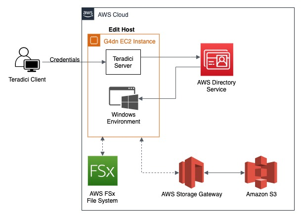

# AWS Cloud Video Editing

This repository contains CloudFormation templates and automation to manage deployment of a Cloud Editing environment. More details on architectural considerations and best practices can be found at this [AWS Media blog post](https://aws.amazon.com/blogs/media/running-adobe-creative-cloud-suite-on-aws/) .

**Caveat** Explore, build and deploy this as a _sandbox_ operating environment only. It is not reccomended to run this in production without extensive testing.

## Architecture

## Pre-requisites

### S3 Buckets
* CloudFormationBucketName - S3 bucket to host the CloudFormation templates (this repo)
	*	*Known Limitation* Each region that this CFN is run in, must have a new S3 bucket.

* AssetS3BucketName - S3 bucket to host all the shared media assets - will be the home dir for the apps used in the Cloud Video Editing workflows (like Adobe Premiere Pro, etc.)
	* Ideal if the region of the Assets Bucket is the same as that of the edit host infrastructure to maintain low latency in-region access.

### AWS CLI Profile
The scripts used below expects a profile.
You can create a profile by following [this guide](https://docs.aws.amazon.com/cli/latest/userguide/cli-configure-profiles.html)

### Key Pair
[Create a Key Pair](https://docs.aws.amazon.com/AWSEC2/latest/UserGuide/ec2-key-pairs.html#having-ec2-create-your-key-pair) in the region you plan on building this cloud editing environment.

## Usage

### Purpose
This is essentially to build and deploy a self-contained Cloud Editing environment. This will create:

- A stand-alone VPC across 2 AZs
- A Managed AD domain with an Admin user account
- A single edit host (G4 series) with Teradici installed and NVIDIA Grid drivers configured
- A FSx for Windows filesystem for use in the edit host

### Implementation

* Launch a region-specific stack.
	* [Launch us-east-1 Stack](https://us-east-1.console.aws.amazon.com/cloudformation/home?region=us-east-1#/stacks/create/review?templateURL=https://cloud-video-editing-us-east-1.s3.amazonaws.com/cfn-repo/templates/cloud-video-editing-master-with-FSX.yaml)
	* [Launch us-west-2 Stack](https://us-west-2.console.aws.amazon.com/cloudformation/home?region=us-west-2#/stacks/create/review?templateURL=https://cloud-video-editing-us-west-2.s3-us-west-2.amazonaws.com/cfn-repo/templates/cloud-video-editing-master-with-FSX.yaml)
	* Consult the [CloudFormation Parameters README](Cloudformation_Parameters.md) for more details on the parameters.

### Connect to Edit Host

1. Connect using RDP and enter the Teradici license key using the system tray
1. Login using the PCOIP client on your desktop with Domain Admin Password 
1. On login, the network drive to the underlying storage system selected will be mapped automatically.

## Cookbook

A more detailed guide to using the different CloudFormation templates to implement different use cases is available using the [Cookbook](Cookbook.md) .

## Contributors
- Ben Weigman
- Mark Stephens
- Sachin Holla (sachinh@)
- Matt Herson (mhersonaws@)

## License

This library is licensed under the MIT-0 License. See the [LICENSE file](LICENSE.md) .
